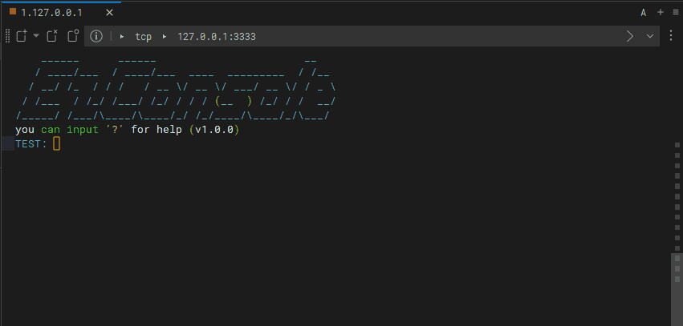
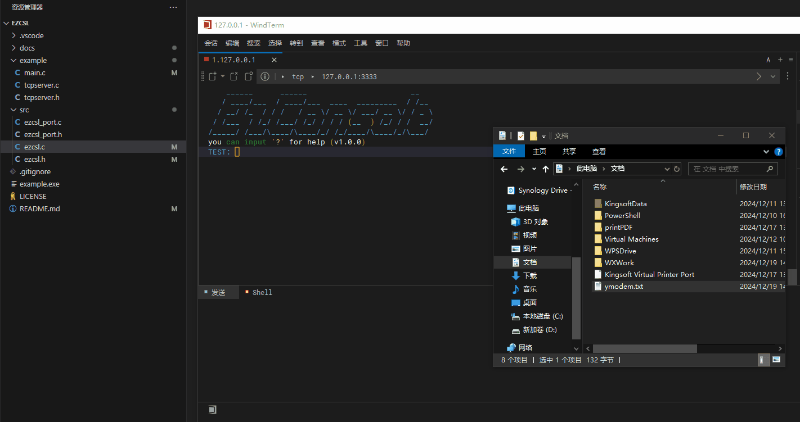
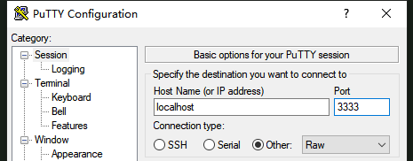

- [EzCSL](#EzCSL)
  - [功能](#功能)
    - [欢迎界面](#欢迎界面)
    - [自动补全](#自动补全)
    - [文件传输（Ymodem）](#文件传输（Ymodem）)
  - [移植](#移植)
  - [教程](#教程)
    - [使用流程](#使用流程)
    - [命令单元](#命令单元)
    - [参数描述](#参数描述)
    - [Ymodem](#Ymodem)
    - [日志模块](#日志模块)
    - [宏配置](#宏配置)
  - [示例](#示例)
    - [如何在TCP模式下运行示例](#如何在TCP模式下运行示例)
    - [如何在cmd模式下运行示例](#如何在cmd模式下运行示例)
  - [如何制作欢迎消息？](#如何制作欢迎消息？)
  - [TODO](#TODO)

# EzCSL

EzCSL（Easy Console）是一个C语言控制台程序，可用于MCU终端仿真。


## 功能
> TCP 示例
### 欢迎界面


### 自动补全


### 文件传输（Ymodem）


## 移植
1. 将`src`下的文件复制到您的项目中。
2. 修改`ezcsl_port.c`文件，加入您自己的`ezport_receive_a_char`的实现（用于接收字符,建议使用MCU中断接收）
3. 修改`ezcsl_port.c`文件，加入您自己的`ezport_send_str`（用于发送字符串,建议使用MCU阻塞发送）的实现。
4. 完成。


## 教程
### 使用流程
1. 调用`ezcsl_init`进行初始化。
2. 调用`ezcsl_cmd_unit_create`创建cmd单元（第一个命令）。
3. 调用`ezcsl_cmd_register`创建您的cmd（第二个命令）。
4. 在循环中调用`ezcsl_tick`。
5. 结束时调用`ezcsl_deinit`。

简单创建一个test命令单元的主要代码，完整代码在example/main.c中：
```c
int main(void){
    ezcsl_init();
    ez_cmd_unit_t *test_unit = ezcsl_cmd_unit_create("test", "add test callback", 0, test_cmd_callback);
    ezcsl_cmd_register(test_unit, TEST_ADD2_ID, "add2", "add,a,b", "ii");
    ezcsl_cmd_register(test_unit, TEST_ADD3_ID, "add3", "add,a,b,c", "iii");

    while (!ezcsl_tick())
        ;
    ezcsl_deinit();
}
```

### 命令单元
命令单元相当于一系列命令的合集，例如`AT,cmd1`,`AT,cmd2`……都属于AT命令单元，每个命令单元拥有一个回调函数，
所有命令的调用都会经过该其所属单元的回调函数（通过自定义ID区分）。

> 以上函数调用可参考example/main.c中test命令单元和echo命令单元。

### 参数描述
i:整数
f:浮点数
s:字符串

### Ymodem
通过`ezcsl_modem_set`设置Ymodem文件接收指令头和回调函数。当EzCsl终端接收到文件时，将调用该回调函数，其中第一次发送的数据帧为传输文件信息，当接收缓冲区指针为NULL时代表发送结束。
> Ymodem传输可参考example/main.c中的处理方式。

### 日志模块
EZ_LOGE：输出错误信息
EZ_LOGD：输出调试信息
EZ_LOGI：输出提示信息
EZ_LOGV：输出普通信息
EZ_PRTL：打印一行信息
EZ_PRT：等同于printf

### 宏配置
| 宏 | 含义 |
| --- | --- |
| CSL_BUF_LEN | 终端缓冲区大小，即终端可以输入的最大字符数 |
| HISTORY_BUF_LEN | 历史缓冲区大小 |
| PRINT_BUF_LEN | printf缓冲区大小 |
| PARA_LEN_MAX | 最大参数数量 |
| SPLIT_CHAR | 分隔字符 |
| LOG_DEFINE | 通过宏启用/禁用日志级别 |
| USE_EZ_MODEM | 选择MODEM（EZ_NO_MODEM或EZ_YMODEM_1K） |

## 示例
该示例可以在Windows上运行。

### 如何在TCP模式下运行示例
1. 克隆此仓库。
2. 进入此仓库的目录。
3. `gcc ./example/*.c ./src/*.c -Iexample -Isrc -lws2_32 -DTCP_MODE -o example`
4. 运行`example(.exe)`。
5. 使用Putty、Windterm等连接到`localhost:3333`。


### 如何在cmd模式下运行示例
1. 克隆此仓库。
2. 进入此仓库的目录。
3. `gcc ./example/*.c ./src/*.c -Iexample -Isrc -lws2_32 -DCMD_MODE -o example`
4. 在支持ANSI的终端（如VSCode终端）中运行`example(.exe)`。

## 如何制作欢迎消息？
[Text to ASCII Art Generator](https://patorjk.com/software/taag/)

## TODO
（添加更多TODO项）